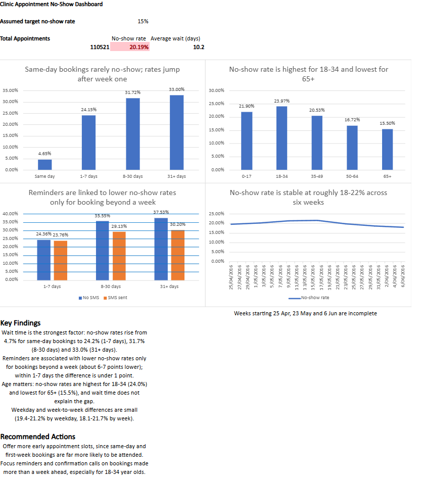

# referral-tracking
# Appointment No-Show KPI Dashboard (Excel)

Portfolio project analysing appointment attendance using a public dataset of medical appointments.

## Data
- Source: [Medical Appointment No Shows (Kaggle)](https://www.kaggle.com/datasets/joniarroba/noshowappointments). Appointments booked in Brazil, 29 April to 8 June 2016. This is not New Zealand data.
- 110,527 records; 6 excluded as invalid (1 negative age, 5 appointment dates before the booking date), leaving 110,521.
- The raw dataset is not included here. See the dataset page for licence terms.

## What the dashboard shows
- Overall no-show rate (20.19%) and average wait (10.2 days)
- No-show rate by wait time, SMS reminder, age group, weekday and week

## Key findings
- Wait time has the strongest link to no-shows: 4.7% for same-day bookings, 24.2% for 1-7 days, 31.7% for 8-30 days, 33.0% for 31+ days.
- Reminders are linked to lower no-show rates only for bookings beyond a week (about 6-7 percentage points lower). Overall, reminders look worse because they are sent mostly for longer waits, which have higher no-show rates anyway (Simpson's paradox).
- No-show rates are highest for ages 18-34 (24.0%) and lowest for 65+ (15.5%); wait time does not explain the gap.
- Differences by weekday (19.4-21.2%) and by week (18.1-21.7%) are small.

## Method
- Cleaned and validated the data, and flagged invalid records rather than deleting them
- Excel table with calculated columns; COUNTIFS, SUMIFS and AVERAGEIFS for each breakdown
- Checked that every breakdown adds up to the overall totals
- Charts and conditional formatting for the dashboard

## Limitations
- Findings are associations, not proof of cause.
- The 15% target no-show rate is an assumption.
- The first and last weeks of data are incomplete, and only two days of data exist for the week of 23 May.

## Files
Screenshots of the dashboard are included. The workbook is available on request.
